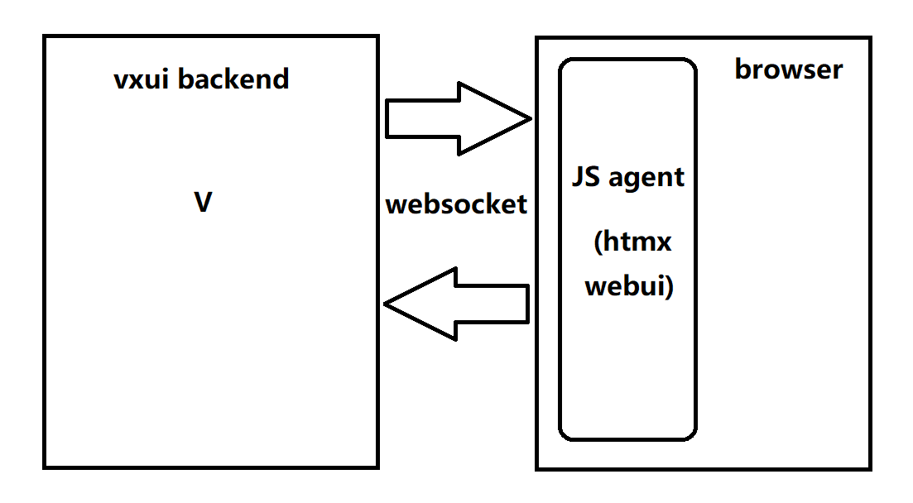
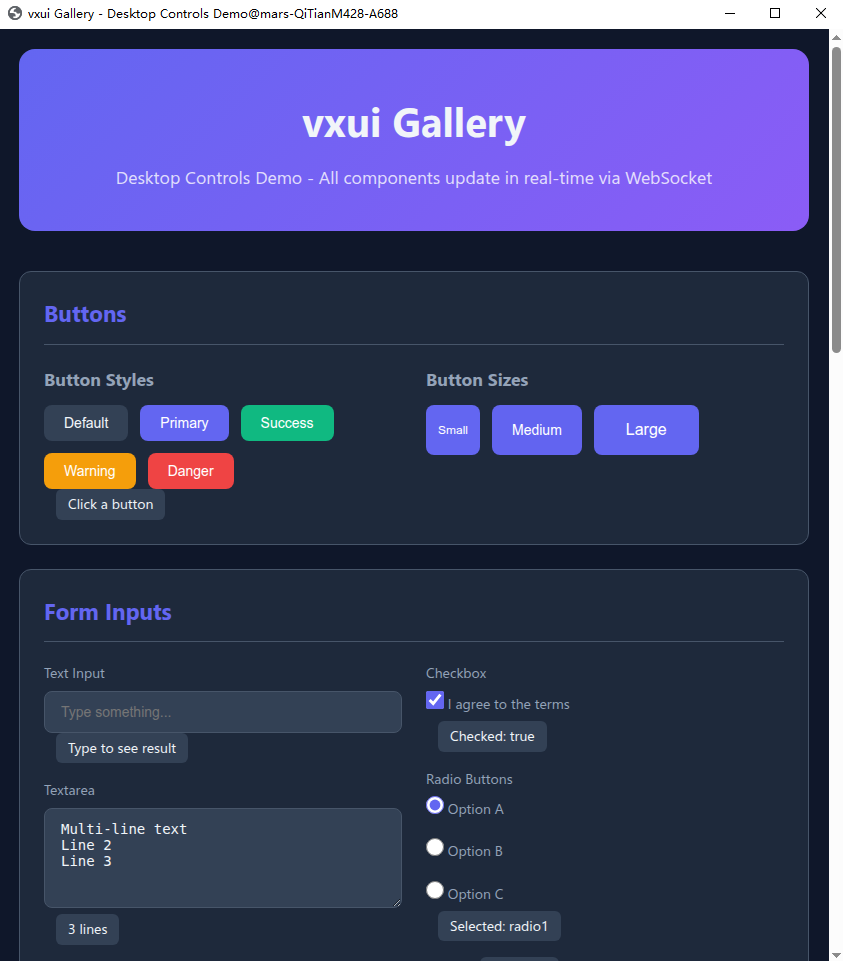
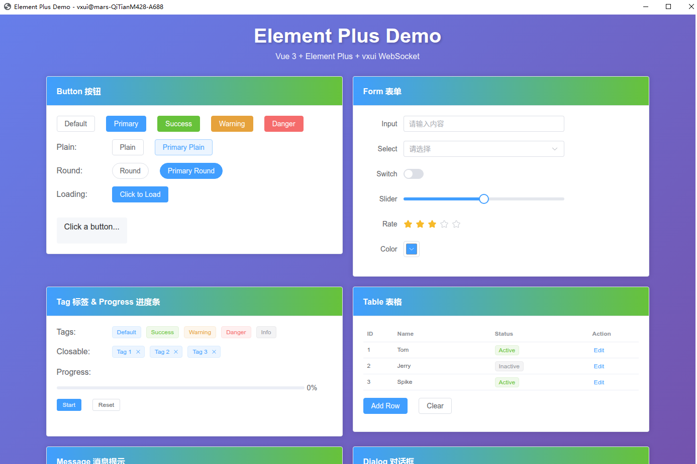
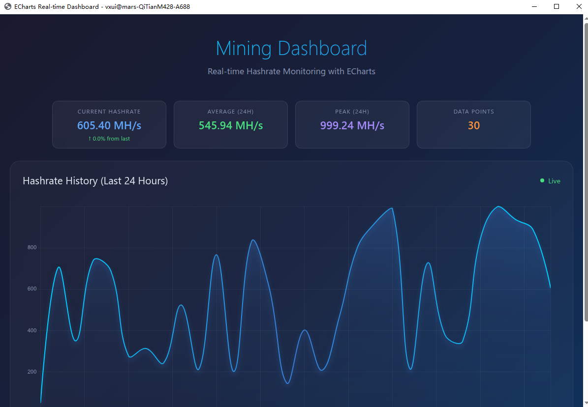
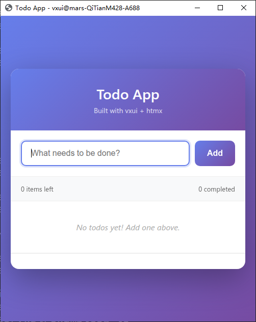
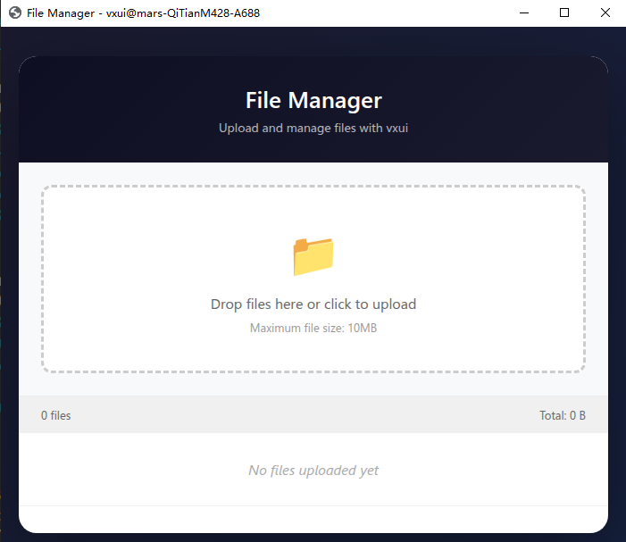

<div align="center">

<h1>vxui</h1>

<p>
  <strong>Build cross-platform desktop apps with V + HTML/CSS/JS</strong>
</p>

<p>
  <a href="https://github.com/kbkpbot/vxui/blob/main/LICENSE">
    
  </a>
  <a href="https://vlang.io">
    
  </a>
  
  
</p>

<p>
  <a href="#features">Features</a> •
  <a href="#quick-start">Quick Start</a> •
  <a href="#examples">Examples</a> •
  <a href="#documentation">Documentation</a> •
  <a href="#contributing">Contributing</a>
</p>



</div>

---

## 📸 Screenshots

<table>
  <tr>
    <td align="center"><b>Gallery Demo</b></td>
    <td align="center"><b>Element Plus</b></td>
  </tr>
  <tr>
    <td></td>
    <td></td>
  </tr>
  <tr>
    <td align="center"><b>Real-time Charts</b></td>
    <td align="center"><b>Todo App</b></td>
  </tr>
  <tr>
    <td></td>
    <td></td>
  </tr>
  <tr>
    <td align="center"><b>File Upload</b></td>
    <td></td>
  </tr>
  <tr>
    <td></td>
    <td></td>
  </tr>
</table>

---

## 🚀 Features

- **⚡ WebSocket-Powered** — Real-time bidirectional communication without HTTP overhead
- **🎨 Use Your Browser** — Leverage modern web technologies for beautiful UIs
- **🔒 Secure by Default** — Token-based authentication, XSS protection, and path traversal prevention
- **🌐 Cross-Platform** — Linux, macOS, and Windows support with auto browser detection
- **📦 Lightweight** — Pure V implementation, no external dependencies
- **🎯 htmx Integration** — Seamless integration with official htmx (no modifications required)
- **🔧 Backend-to-Frontend** — Execute JavaScript from backend with `run_js()`
- **👥 Multi-Client Support** — Optional support for multiple browser clients
- **🚀 Single Executable** — Embed frontend files into binary for easy distribution

## 📋 Table of Contents

- [Introduction](#-introduction)
- [Motivation](#-motivation)
- [Installation](#-installation)
- [Quick Start](#-quick-start)
- [Features](#-features)
- [Architecture](#-architecture)
- [Examples](#-examples)
- [Security](#-security)
- [Browser Support](#-browser-support)
- [Contributing](#-contributing)
- [License](#-license)

## 📖 Introduction

vxui is a lightweight, cross-platform desktop UI framework that uses your browser as the display and V as the backend. Unlike traditional web frameworks, vxui:

- **No HTTP/HTTPS server** — Direct WebSocket communication
- **No build step** — Just V code and HTML files
- **No framework lock-in** — Use any frontend libraries you like

```
vxui = browser + htmx/webui + websocket + V
```

## 💡 Motivation

1. **Every desktop has a browser** — Modern browsers offer better rendering than native GUI toolkits
2. **WebSocket > HTTP** — Why use a web server for desktop apps? WebSocket enables true bidirectional communication
3. **Full-stack V** — Write your entire app in one language

## 📦 Installation

### Prerequisites

- [V](https://vlang.io) (v0.4.0 or later)
- Chrome, Chromium, Edge, or Firefox

### Install via VPM

```bash
v install --git https://github.com/kbkpbot/vxui.git
```

### Manual Installation

```bash
git clone https://github.com/kbkpbot/vxui.git ~/.vmodules/vxui
```

## 🚀 Quick Start

### 1. Create your app (`main.v`)

```v
module main

import vxui
import x.json2

struct App {
    vxui.Context
mut:
    counter int
}

@['/clicked']
fn (mut app App) clicked(message map[string]json2.Any) string {
    app.counter++
    return '<div id="counter">Count: ${app.counter}</div>'
}

fn main() {
    mut app := App{}
    app.logger.set_level(.debug)
    vxui.run(mut app, './ui/index.html') or {
        eprintln('Error: ${err}')
        exit(1)
    }
}
```

### 2. Create your UI (`ui/index.html`)

```html
<!DOCTYPE html>
<html>
<head>
    <script src="./js/htmx.js"></script>
    <script src="./js/vxui-ws.js"></script>
</head>
<body>
    <h1>Hello vxui!</h1>
    <button hx-post="/clicked" hx-swap="outerHTML">
        Click Me
    </button>
    <div id="counter">Count: 0</div>
</body>
</html>
```

### 3. Run

```bash
v run main.v
```

## 🏗️ Architecture

```
┌─────────────────┐      WebSocket      ┌─────────────────┐
│   Browser       │ ◄─────────────────► │   V Backend     │
│  (HTML/CSS/JS)  │    (No HTTP!)       │  (WebSocket     │
│                 │                     │   Server)       │
└─────────────────┘                     └─────────────────┘
       │                                          │
       │ htmx events                              │ Method calls
       ▼                                          ▼
┌─────────────────┐                     ┌─────────────────┐
│  vxui-ws.js    │                     │   Route Handler │
│  (Intercepts    │                     │   (Your code!)  │
│   AJAX calls)   │                     │                 │
└─────────────────┘                     └─────────────────┘
```

### How it works

1. **Start** — vxui finds a free port and starts a WebSocket server
2. **Launch** — Detects and launches your system browser with the HTML file
3. **Connect** — Browser connects to WebSocket server via `vxui-ws.js`
4. **Interact** — User actions trigger WebSocket messages instead of HTTP requests
5. **Respond** — V handlers return HTML fragments for dynamic updates

## 📚 Examples

### Basic Form Handling

See [`examples/test/`](examples/test/) for a complete form handling example with:
- Modern dark theme with glassmorphism
- Input validation
- Dynamic updates
- Edit/Cancel workflow

### Real-time Charts

See [`examples/enchart/`](examples/enchart/) for:
- Modern dashboard UI with dark theme
- ECharts integration with gradient charts
- Real-time data streaming with live statistics
- Stat cards showing current/average/peak values

### Gallery Demo

See [`examples/gallery/`](examples/gallery/) for a comprehensive UI controls demo:
- Buttons, forms, inputs
- Progress bars, tabs, tables
- Cards, modals, notifications
- Dark mode toggle

### Element Plus Integration

See [`examples/element-plus/`](examples/element-plus/) for Vue 3 + Element Plus integration:
- Professional UI components (Button, Form, Table, Dialog, etc.)
- Backend-driven notifications via `run_js()`
- Demonstrates vxui with modern Vue 3 ecosystem

Run examples:

```bash
cd examples/test
v run main.v
```

## ✨ Features

### Execute JavaScript from Backend

Use `run_js()` to execute JavaScript in the browser and get results:

```v
// Execute on first connected client
result := app.run_js('document.title', 5000)!  // 5 second timeout
println('Page title: ${result}')

// Execute on specific client
result := app.run_js_client(client_id, 'alert("Hello!")', 3000)!
```

### Multi-Client Support

Enable multiple browser connections:

```v
fn main() {
    mut app := App{}
    app.multi_client = true  // Allow multiple clients
    vxui.run(mut app, './ui/index.html')!
}

// In your handlers:
fn (mut app App) broadcast_msg(msg map[string]json2.Any) string {
    // Get all connected clients
    clients := app.get_clients()
    
    // Broadcast to all
    app.broadcast('<div hx-swap-oob="true">Server update</div>')!
    
    return '<div>Sent to ${clients.len} clients</div>'
}
```

### Window Management

Control browser window size and position:

```v
fn main() {
    mut app := App{}
    app.set_window_size(1200, 800)
    app.set_window_position(-1, -1)  // -1 = center
    app.set_window_title('My Application')
    vxui.run(mut app, './ui/index.html')!
}
```

### Single Executable Distribution

Embed frontend files into the binary for easy distribution:

```v
module main

import vxui

// Embed frontend files at compile time
const index_html = $embed_file('ui/index.html')
const app_js = $embed_file('ui/app.js')
const style_css = $embed_file('ui/style.css')

struct App {
    vxui.Context
}

fn main() {
    mut app := App{}
    
    // Create packed app with embedded files
    mut packed := vxui.new_packed_app()
    packed.add_file_string('index.html', index_html.to_string())
    packed.add_file_string('app.js', app_js.to_string())
    packed.add_file_string('style.css', style_css.to_string())
    
    // Run with packed resources
    vxui.run_packed(mut app, mut packed, 'index.html')!
}
```

Build single executable:
```bash
v -prod main.v           # Production build (~1.4 MB)
v -prod -compress main.v # Compressed build (smaller)
```

Result: A single `.exe` file containing all frontend assets!

## 🔒 Security

vxui includes several security features:

- **Token Authentication** — Auto-generated security token for client verification
- **XSS Protection** — Built-in HTML/JS escaping functions
- **Path Traversal Prevention** — Input sanitization
- **No External Network** — WebSocket only binds to localhost

### Token Authentication

Every connection requires token verification:

```v
fn main() {
    mut app := App{}
    // Token is auto-generated, or set manually:
    // app.token = 'my-secret-token'
    
    // Get token for debugging
    println('Token: ${app.get_token()}')
    
    vxui.run(mut app, './ui/index.html')!
}
```

### Safe Output Example

```v
import vxui

fn (mut app App) handler(msg map[string]json2.Any) string {
    user_input := msg['name'] or { '' }.str()
    safe := vxui.escape_html(user_input)
    return '<div>Hello ${safe}</div>'
}
```

## 🌍 Browser Support

vxui auto-detects and supports:

| Browser | Linux | macOS | Windows |
|---------|-------|-------|---------|
| Chrome | ✅ | ✅ | ✅ |
| Chromium | ✅ | ✅ | ❌ |
| Edge | ✅ | ✅ | ✅ |
| Firefox | ✅ | ✅ | ✅ |
| Brave | ✅ | ❌ | ❌ |

## 📖 Documentation

- [API Reference](doc/vxui.md) — Auto-generated from source
- [Architecture Guide](AGENTS.md) — Internal design documentation

## 🤝 Contributing

We welcome contributions! Please see [CONTRIBUTING.md](CONTRIBUTING.md) for guidelines.

### Development

```bash
# Clone the repo
git clone https://github.com/kbkpbot/vxui.git
cd vxui

# Run tests
v test vxui_test.v

# Format code
v fmt -w .
```

## 🛡️ License

This project is licensed under the [MIT License](LICENSE).

## 🙏 Acknowledgments

- [V Language](https://vlang.io/) — The amazing language powering vxui
- [htmx](https://htmx.org/) — The frontend library for dynamic HTML

## ⚠️ Alpha Notice

vxui is currently in **alpha** stage. APIs may change, and some features are still being developed. Please report any issues you encounter!

---

<div align="center">
  <sub>Built with ❤️ by <a href="https://github.com/kbkpbot">kbkpbot</a> and contributors</sub>
</div>